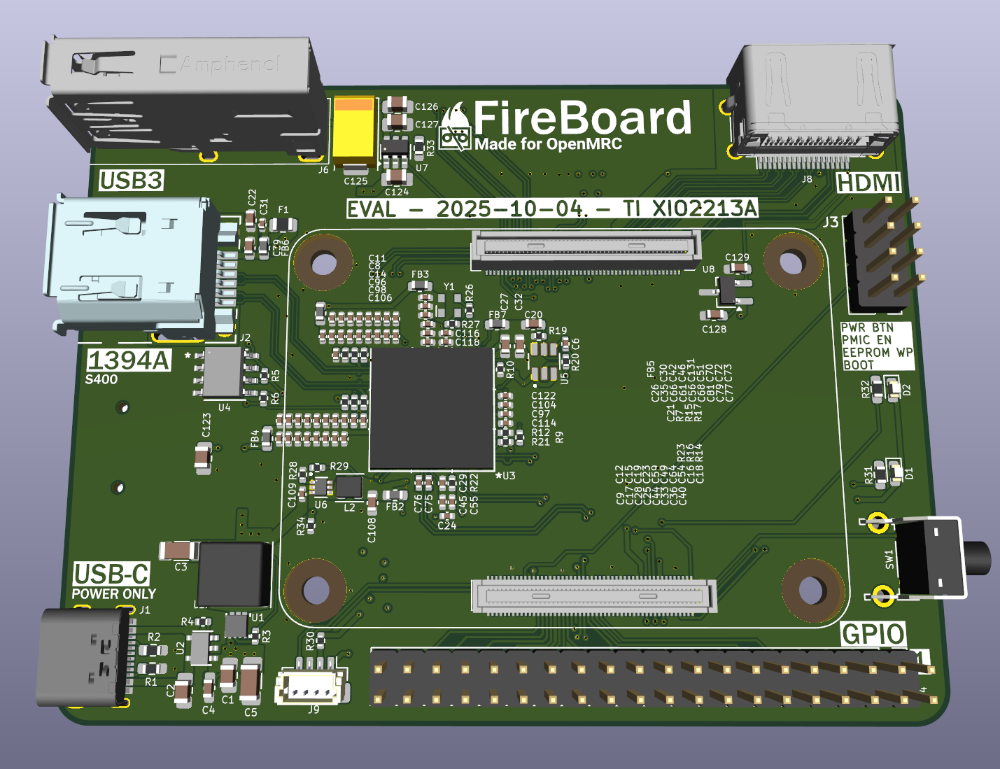
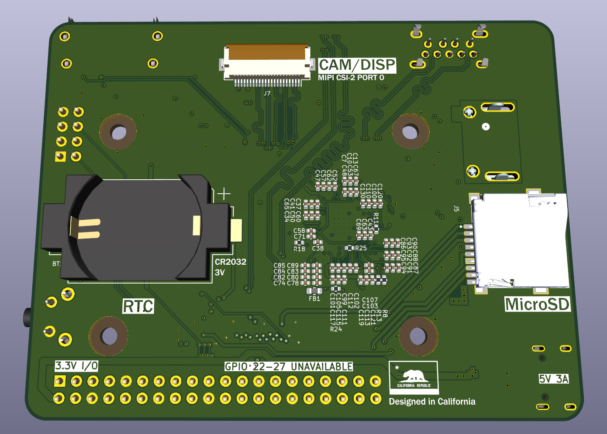

# OpenMRC  

A modern, open-source re-creation of the classic FireWire DTE recorders — powered by Raspberry Pi.  

  

---

## 🚀 Project Overview  

**OpenMRC** is a global community-driven project developing a **video/audio recorder** based on Raspberry Pi hardware.  
Our goal is to bring back the workflow of classic FireWire-based Digital Tape Equipment (DTE) recorders — but with a modern, open-source twist.  

Currently, around **8 contributors worldwide** are actively working on both hardware and software.  

---

## 🛠️ Hardware  

[🔗 OpenMRC Hardware Repository](https://github.com/openMRC/Hardware)  

The main hardware path right now is the **FireBoard**, a CM5-based carrier board with integrated FireWire.  

### FireBoard Features  
- Built-in FireWire chip (VT6315N)  
- Full-size HDMI  
- DSI/CSI ports  
- USB3 port  
- MicroSD slot  
- FireWire port  
- ~90% design complete, validation in progress before prototype order  
- 3D-printable cases being designed in parallel  

---

## 💻 Software  

[🔗 OpenMRC Software Repository](https://github.com/openMRC/Software)  

Software development is centered on making OpenMRC reliable, efficient, and user-friendly.  

### Highlights  
- **FFmpeg** selected as the core recording engine (replacing dvgrab)  
  - Realtime preview via `ffplay`  
  - Expanded feature support  
- Plans for a **stripped-down kernel** for better efficiency  
- UI design:  
  - Hybrid touchscreen + rotary encoder (inspired by iPods & iPhones)  
- Development in C and exploration of Qt for GUI  
- Features under development:  
  - Built-in level gauge  
  - Precompiled kernel for easy deployment  
  - Potential dedicated OpenMRC distribution  

---

## 🎨 Design & Community  

- 3D-printed cases designed in parallel with hardware  
- Artists needed for an **official OpenMRC logo**  
- Active discussions and updates happening on Discord and Reddit  

---

## 🌍 Community & Updates  

Want realtime updates and to get involved?  
Join us here: [Computer Equipment Group Discord](https://discord.gg/XP8uHH9ArF)  

Follow updates on **r/tapeless** as well.  

---

## 📌 TL;DR  

- OpenMRC = **Open Source FireWire DV Recorder**  
- Hardware: Raspberry Pi + custom PCBs (Equip-1 & FireBoard)  
- Software: FFmpeg-based recording, optimized kernels, modern UI concepts  
- Global collaboration of engineers, designers, and developers  

---

## 📷 Gallery  

Here are some early looks at the FireBoard hardware and case designs:  

  
*FireBoard overview render*  

  
*Closer detail of FireBoard layout*  

  
*Top view of FireBoard PCB*  

  
*Bottom view of FireBoard PCB*  

  
*3D printed case design for FireBoard*  

---

## 🙌 Contributing  

OpenMRC is a community project — contributions are welcome!  
Whether you’re into **hardware design, software development, case prototyping, or UI/UX design**, there’s a place for you.  

- Fork us on GitHub  
- Join the [Discord](https://discord.gg/XP8uHH9ArF)  
- Share ideas on r/tapeless  

---

## 📜 License  

OpenMRC is fully open source.  
License details will be announced soon (GPLv3 / CERN OHL under discussion).  

---

© 2025 OpenMRC Project. Community-powered.  
